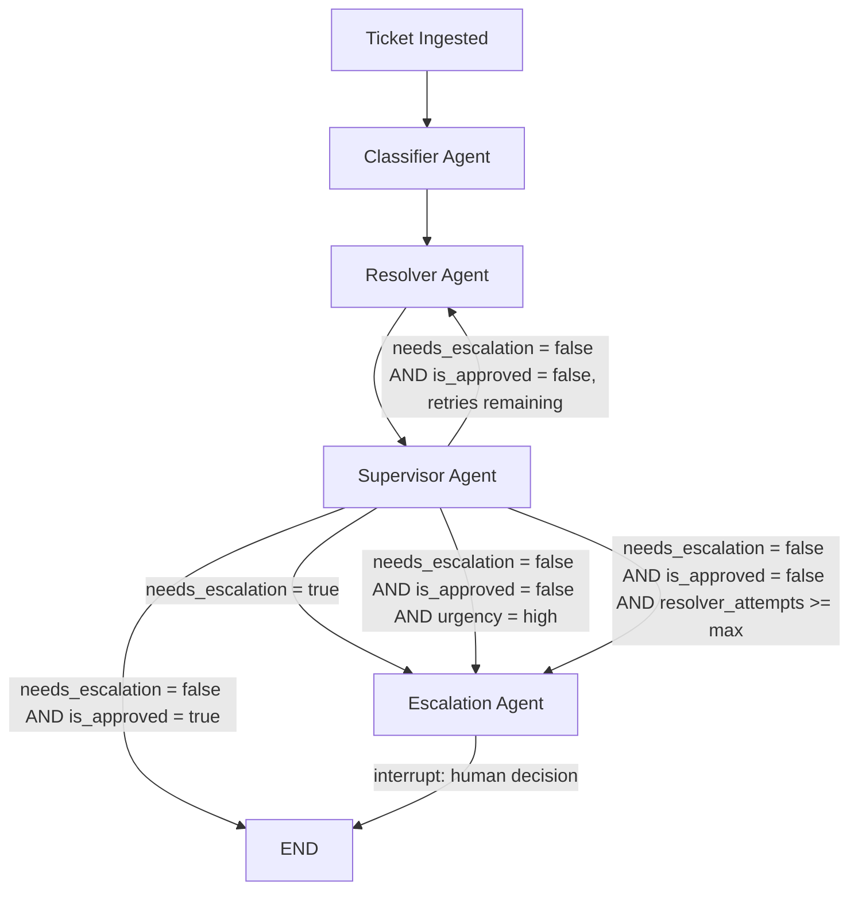

# UDA-Hub

UDA-Hub is a LangGraph-based multi-agent customer support system for **CultPass**,
a cultural-experience membership service. Four specialized agents process each
ticket in a fixed sequence: tickets are classified, resolved against a RAG-grounded
knowledge base, and reviewed by a supervisor agent. A ticket is escalated to a human
via human-in-the-loop when confidence is low, policy requires it, or the answer
cannot be approved after repeated attempts. Persistent short-term and long-term
memory is maintained across the conversation.

## Architecture Pattern
This system follows a **Pipeline (sequential) pattern with conditional routing**: tickets flow through a fixed sequence of specialized agents (Classifier → Resolver → Supervisor), with conditional edges routing to rework, escalation, or termination based on each stage's output. Control flow is fully explicit and defined at the graph level via LangGraph's conditional edges — it is not decided dynamically by a routing LLM. This is a deliberate contrast to a supervisor-orchestrator pattern (a single routing agent dispatching to peer agents at its own discretion); our `Supervisor Agent` is a quality-review stage in this pipeline, not a routing orchestrator, despite the shared name.

## System Flow



## Agents

### 1. Classifier Agent
- **Role**: Reads the ticket content and the customer's history summary, then classifies category, sentiment, and urgency via structured output (Pydantic + `Literal`), and makes an initial judgment on whether human review is needed (`needs_escalation`). If the customer's history shows a repeated issue in the same category, this raises the assigned urgency.
- **Input**: `ticket_content` (from `messages`), `user_id` (used to fetch a history summary)
- **Output**: `category`, `sentiment`, `urgency`, `needs_escalation`
- **Next step**: Always proceeds to Resolver (routing on `needs_escalation` is deferred until after Supervisor review — see Information Flow)

### 2. Resolver Agent
- **Role**: Generates a draft answer strictly grounded in the `search_knowledge` tool's results. If no relevant knowledge base article is found (or relevance is too low), it independently sets `needs_escalation` to true rather than answering from general knowledge. May also call `search_experiences`, `check_booking_status`, `list_tickets_by_category`, or `get_ticket_detail` when the ticket calls for those specific lookups. On rework, revises the draft using the Supervisor's rejection reason.
- **Input**: `ticket_content`, `escalation_reason` (if reworking)
- **Output**: `draft_answer`, `needs_escalation` (merged with the Classifier's judgment via OR), `escalation_reason`, `resolver_attempts` (incremented)
- **Next step**: Always proceeds to Supervisor

### 3. Supervisor Agent
- **Role**: Reviews the `draft_answer` for accuracy and policy compliance via structured output (approve/reject), and records a reason (`escalation_reason`) on rejection — including a synthesized reason when the retry limit has been exhausted. On approval, persists the resolved ticket to long-term memory.
- **Input**: `draft_answer`, `resolver_attempts`
- **Output**: `is_approved`, `escalation_reason` (on rejection), `resolved_by` ("ai", on approval)
- **Next step**: Routed by `route_after_supervisor` (see below) — not solely by its own decision

### 4. Escalation Agent
- **Role**: Summarizes the ticket context for a human agent (`interrupt()`), then finalizes the answer based on the human's decision (`Command(resume=...)`). Persists the resolved ticket to long-term memory regardless of who wrote the final answer.
- **Input**: `ticket_content`, `category`, `sentiment`, `escalation_reason`, `draft_answer`
- **Output**: `final_answer`, `resolved_by` ("human" or "ai_approved_by_human")
- **Next step**: Ends the flow

## Routing Priority (`route_after_supervisor`)
Routing after the Supervisor stage evaluates conditions in a fixed priority order, since more than one condition can be true simultaneously:
1. `needs_escalation == true` → Escalation (an explicit signal from the Classifier or Resolver overrides a later approval)
2. `is_approved == true` → END
3. `urgency == "high"` → Escalation (even an approved-quality answer gets a human check for high-stakes tickets)
4. `resolver_attempts >= MAX_RESOLVER_ATTEMPTS` → Escalation (prevents infinite Resolver/Supervisor rework loops)
5. Otherwise → back to Resolver for rework

## Information Flow
Each agent reads the shared `TicketState` and writes only the fields it owns, allowing downstream agents to access all upstream decisions without needing them re-passed explicitly. The Classifier sets `category`, `sentiment`, `urgency`, and an initial `needs_escalation`, which persist through the rest of the flow. Routing on `needs_escalation` is deferred until after the Supervisor stage so that a draft answer and quality review are always produced, even for tickets likely headed for human review. The Resolver reads `ticket_content` and, if present, `escalation_reason` (to revise a previously rejected draft); it writes `draft_answer` and may independently raise `needs_escalation` to true (merged with the Classifier's value via logical OR) if grounding knowledge cannot be found. The Supervisor reads `draft_answer` and `resolver_attempts` and decides `is_approved`; on rejection, it writes `escalation_reason`, synthesizing a retry-exhaustion message if the attempt limit has been reached. The Escalation agent is the only agent that pauses execution (`interrupt()`), synchronously waiting for a human decision before writing `final_answer` and `resolved_by`.

## Input/Output Behavior

### Input
A ticket enters the graph as a `messages` list (the customer's inquiry, via `add_messages`) plus a `user_id` identifying the customer. No pre-classification is required from the caller.

### Output scenarios
| Scenario | Path | Final output |
|---|---|---|
| Routine inquiry, grounded in knowledge base, approved | Classifier → Resolver → Supervisor → END | `final_answer` = AI-generated answer; `resolved_by` = "ai" |
| Draft rejected, resolved after rework | Classifier → Resolver → Supervisor → Resolver → Supervisor → END | Same as above, after 1+ retry |
| No relevant knowledge base article found | Classifier → Resolver (self-flags needs_escalation) → Supervisor → Escalation → END | `final_answer` = human-written or human-approved answer; `resolved_by` = "human" or "ai_approved_by_human" |
| High urgency, even if approved | Classifier → Resolver → Supervisor (approved) → Escalation → END | Same as above |
| Repeated rejections exceed the retry limit | Classifier → Resolver → Supervisor (×N) → Escalation → END | Same as above; `escalation_reason` notes the retry exhaustion |

## State Schema
`TicketState` in `state.py` (TypedDict, `total=False`)

| Field | Type | Description | Set by |
|---|---|---|---|
| user_id | str | Customer identifier, used for long-term history lookup and storage | Input |
| messages | List[BaseMessage] (`add_messages`) | Conversation history with the customer | Input / Supervisor / Escalation |
| category | Literal["billing","booking","technical","general"] | Classifier's category decision | Classifier |
| sentiment | Literal["positive","neutral","negative"] | Customer's emotional tone | Classifier |
| urgency | Literal["low","medium","high"] | Urgency level; raised if history shows a repeated issue | Classifier |
| needs_escalation | bool | Whether human review is required | Classifier (initial), Resolver (can raise further) |
| draft_answer | str | Draft answer generated by Resolver | Resolver |
| resolver_attempts | int | Number of times Resolver has produced a draft for this ticket | Resolver |
| is_approved | bool | Supervisor's approval decision | Supervisor |
| escalation_reason | str | Reason for rejection/escalation | Supervisor (on rejection), Resolver (when self-flagging) |
| final_answer | str | Final answer delivered to the customer | Supervisor (on approval) / Escalation |
| resolved_by | str | "ai", "ai_approved_by_human", or "human" | Supervisor / Escalation |

## Tools
- `search_knowledge(query)` — RAG retrieval over the CultPass policy knowledge base (`Knowledge` table), keyword-scored with a relevance score used as a confidence signal
- `search_experiences(location, keyword)` — Searches the CultPass experience catalog
- `check_booking_status(reservation_id)` — Looks up reservation status
- `list_tickets_by_category(external_user_id, category)` — Lists a customer's past ticket IDs in a category, for deeper history lookup
- `get_ticket_detail(ticket_id)` — Fetches the full conversation of a specific past ticket

All tools return a structured `{"success": bool, ...}` response and handle database errors without crashing the agent.

## Persistence
- **Short-term memory**: `SqliteSaver` (checkpointer) — persists State snapshots per `thread_id` (= ticket ID) to `checkpoints.db`, surviving process restarts. Used for `interrupt()`/resume in Escalation, and can be inspected per-thread via `get_state_history`.
- **Long-term memory**: Implemented via the `udahub.db` `User`/`Ticket`/`TicketMetadata`/`TicketMessage` tables (not a separate LangGraph Store). `save_resolved_ticket` persists resolved tickets per customer; `get_customer_history_summary` returns a lightweight, category-level aggregate (count + most recent date) to avoid unbounded prompt growth as history accumulates. Deeper detail is available on demand via `list_tickets_by_category` and `get_ticket_detail` — a summary-then-pointer pattern rather than loading full history into every prompt.

## Logging
Each agent emits a structured JSON log line (`log_event`) recording its node name, timestamp, and key decision fields (category/urgency/needs_escalation for the Classifier; tools called and escalation flags for the Resolver; approve/reject decision for the Supervisor; resolution outcome for Escalation). This provides a searchable audit trail of routing choices and tool usage per ticket.

## Getting Started

Instructions for how to get a copy of the project running on your local
machine.

### Dependencies

```
python >= 3.11
langgraph>=0.5.4
langgraph-checkpoint-sqlite>=2.0.0
langchain>=0.3.27
langchain-core>=0.3.72
langchain-openai>=0.3.28
sqlalchemy>=2.0.41
pydantic>=2.0.0
python-dotenv>=1.1.1
ipykernel>=6.30.0
```

(See `requirements.txt` for the full pinned list.)

### Installation

Step by step explanation of how to get a dev environment running.

1. Clone the repository and create a virtual environment:

```
git clone <repo-url>
cd uda-hub
python -m venv venv
venv\Scripts\activate        # Windows
pip install -r requirements.txt
```

2. Copy the environment template and fill in your API key:

```
cp .env.example .env
```

3. Seed the databases by running the setup notebooks in order:

```
01_external_db_setup.ipynb   # seeds data/external/cultpass.db
02_core_db_setup.ipynb       # seeds data/core/udahub.db
```

4. Run the agentic app:

```
03_agentic_app.ipynb
```

## Testing

This project is verified through interactive scenario testing rather than
an automated test suite. Run `03_agentic_app.ipynb` and invoke
`chat_interface(orchestrator, "<ticket_id>", "<user_id>")` with the demo
tickets below to confirm correct classification, resolution, and
escalation behavior across categories.

### Break Down Tests

```python
chat_interface(orchestrator, "demo_1", "f556c0")
# Input: My QR code won't scan at the venue entrance.
# -> Resolved by RAG (search_knowledge match), no escalation needed.

chat_interface(orchestrator, "demo_2", "a4ab87")
# Input: Someone next to me was very loud during last week's concert
#        and I want to file a complaint.
# -> No confident knowledge match -> escalated to human review.

chat_interface(orchestrator, "demo_3", "f556c0")
# Input: My QR code failed again today, same as before.
# -> Same user, repeated issue; resolver finds no article addressing
#    repeated failures -> escalated even though the supervisor approved
#    the draft.

chat_interface(orchestrator, "demo_4", "f556c0")
# Input: My payment was charged twice right now and I need this fixed
#        urgently.
# -> Classifier flags urgency=high and needs_escalation immediately ->
#    escalated regardless of supervisor's decision.
```

Each scenario uses a distinct `thread_id` (`demo_1`-`demo_4`) so
checkpointed state doesn't bleed across tickets, and reuses
`external_user_id`s from the seeded CultPass users (`f556c0`, `a4ab87`) to
exercise the long-term memory lookup (`get_customer_history_summary`).

## End-to-End Demo

### Scenario 1: Successful AI resolution (RAG hit)

Classifier -> Resolver (search_knowledge hit) -> Supervisor (approved) -> END

### Scenario 2: Escalation due to no relevant knowledge found (RAG miss)

Classifier -> Resolver (search_knowledge miss, needs_escalation=True) -> Supervisor -> Escalation -> interrupt -> END

### Scenario 3: Returning customer — repeated issue raises urgency

Classifier -> Resolver (search_knowledge miss on repeated-issue query, needs_escalation=True) -> Supervisor (approved) -> Escalation (needs_escalation overrides approval) -> interrupt -> END

### Scenario 4: High urgency ticket routed directly to escalation

Classifier (urgency=high, needs_escalation=True) -> Resolver (confirms needs_escalation=True) -> Supervisor (rejected) -> Escalation -> interrupt -> END

## Project Instructions

This section should contain all the student deliverables for this project.

- Multi-agent architecture: Classifier -> Resolver -> Supervisor ->
  Escalation, orchestrated as a LangGraph `StateGraph`.
- Intelligent routing based on ticket metadata (category, sentiment,
  urgency) with a fixed priority order: escalation flag -> approval ->
  urgency -> retry limit.
- RAG-based knowledge retrieval (`search_knowledge`) with relevance
  scoring and escalation when no confident match is found.
- 5 DB-abstracted tools (`search_knowledge`, `search_experiences`,
  `check_booking_status`, `list_tickets_by_category`, `get_ticket_detail`)
  with input validation and `try/except SQLAlchemyError` handling.
- Persistent short-term memory via `SqliteSaver` (thread-scoped by
  ticket_id) and long-term memory via `udahub.db`
  (User / Ticket / TicketMetadata / TicketMessage).
- Full end-to-end integration with structured JSON logging of every
  agent decision and tool call.

See `design/architecture.md` for the full pipeline diagram and design
rationale.

## Built With

* [LangGraph](https://www.langchain.com/langgraph) - Multi-agent orchestration, conditional routing, and human-in-the-loop via `interrupt()`
* [LangChain](https://www.langchain.com/) - LLM integration and tool-calling abstractions
* [OpenAI API](https://platform.openai.com/) - gpt-4o / gpt-4o-mini via Vocareum proxy
* [SQLAlchemy](https://www.sqlalchemy.org/) - ORM for cultpass.db and udahub.db
* [Pydantic](https://docs.pydantic.dev/) - Structured output schemas for agent responses
* [SQLite](https://www.sqlite.org/) - Persistence layer (business data + CS system of record)

## License

[License](../LICENSE.md)