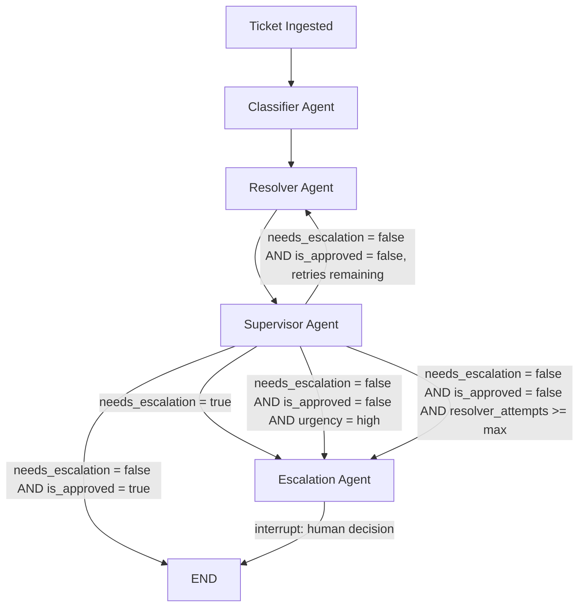

# UDA-Hub Architecture

## Overview
UDA-Hub is a LangGraph-based multi-agent system that processes customer support tickets for CultPass (an experience/membership service).
Four specialized agents process each ticket in a fixed sequence, escalating to a human when confidence is low, policy requires it, or the answer cannot be approved after repeated attempts.

## Architecture Pattern
This system follows a **Pipeline (sequential) pattern with conditional routing**: tickets flow through a fixed sequence of specialized agents (Classifier → Resolver → Supervisor), with conditional edges routing to rework, escalation, or termination based on each stage's output. Control flow is fully explicit and defined at the graph level via LangGraph's conditional edges — it is not decided dynamically by a routing LLM. This is a deliberate contrast to a supervisor-orchestrator pattern (a single routing agent dispatching to peer agents at its own discretion); our `Supervisor Agent` is a quality-review stage in this pipeline, not a routing orchestrator, despite the shared name.

## System Flow

## Agents

### 1. Classifier Agent
- **Role**: Reads the ticket content and the customer's history summary, then classifies category, sentiment, and urgency via structured output (Pydantic + `Literal`), and makes an initial judgment on whether human review is needed (`needs_escalation`). If the customer's history shows a repeated issue in the same category, this raises the assigned urgency.
- **Input**: `ticket_content` (from `messages`), `user_id` (used to fetch a history summary)
- **Output**: `category`, `sentiment`, `urgency`, `needs_escalation`
- **Next step**: Always proceeds to Resolver (routing on `needs_escalation` is deferred until after Supervisor review — see Information Flow)

### 2. Resolver Agent
- **Role**: Generates a draft answer strictly grounded in the `search_knowledge` tool's results. If no relevant knowledge base article is found (or relevance is too low), it independently sets `needs_escalation` to true rather than answering from general knowledge. May also call `search_experiences`, `check_booking_status`, `list_tickets_by_category`, or `get_ticket_detail` when the ticket calls for those specific lookups. On rework, revises the draft using the Supervisor's rejection reason.
- **Input**: `ticket_content`, `escalation_reason` (if reworking)
- **Output**: `draft_answer`, `needs_escalation` (merged with the Classifier's judgment via OR), `escalation_reason`, `resolver_attempts` (incremented)
- **Next step**: Always proceeds to Supervisor

### 3. Supervisor Agent
- **Role**: Reviews the `draft_answer` for accuracy and policy compliance via structured output (approve/reject), and records a reason (`escalation_reason`) on rejection — including a synthesized reason when the retry limit has been exhausted. On approval, persists the resolved ticket to long-term memory.
- **Input**: `draft_answer`, `resolver_attempts`
- **Output**: `is_approved`, `escalation_reason` (on rejection), `resolved_by` ("ai", on approval)
- **Next step**: Routed by `route_after_supervisor` (see below) — not solely by its own decision

### 4. Escalation Agent
- **Role**: Summarizes the ticket context for a human agent (`interrupt()`), then finalizes the answer based on the human's decision (`Command(resume=...)`). Persists the resolved ticket to long-term memory regardless of who wrote the final answer.
- **Input**: `ticket_content`, `category`, `sentiment`, `escalation_reason`, `draft_answer`
- **Output**: `final_answer`, `resolved_by` ("human" or "ai_approved_by_human")
- **Next step**: Ends the flow

## Routing Priority (`route_after_supervisor`)
Routing after the Supervisor stage evaluates conditions in a fixed priority order, since more than one condition can be true simultaneously:
1. `needs_escalation == true` → Escalation (an explicit signal from the Classifier or Resolver overrides a later approval)
2. `is_approved == true` → END
3. `urgency == "high"` → Escalation (even an approved-quality answer gets a human check for high-stakes tickets)
4. `resolver_attempts >= MAX_RESOLVER_ATTEMPTS` → Escalation (prevents infinite Resolver/Supervisor rework loops)
5. Otherwise → back to Resolver for rework

## Information Flow
Each agent reads the shared `TicketState` and writes only the fields it owns, allowing downstream agents to access all upstream decisions without needing them re-passed explicitly. The Classifier sets `category`, `sentiment`, `urgency`, and an initial `needs_escalation`, which persist through the rest of the flow. Routing on `needs_escalation` is deferred until after the Supervisor stage so that a draft answer and quality review are always produced, even for tickets likely headed for human review. The Resolver reads `ticket_content` and, if present, `escalation_reason` (to revise a previously rejected draft); it writes `draft_answer` and may independently raise `needs_escalation` to true (merged with the Classifier's value via logical OR) if grounding knowledge cannot be found. The Supervisor reads `draft_answer` and `resolver_attempts` and decides `is_approved`; on rejection, it writes `escalation_reason`, synthesizing a retry-exhaustion message if the attempt limit has been reached. The Escalation agent is the only agent that pauses execution (`interrupt()`), synchronously waiting for a human decision before writing `final_answer` and `resolved_by`.

## Input/Output Behavior

### Input
A ticket enters the graph as a `messages` list (the customer's inquiry, via `add_messages`) plus a `user_id` identifying the customer. No pre-classification is required from the caller.

### Output scenarios
| Scenario | Path | Final output |
|---|---|---|
| Routine inquiry, grounded in knowledge base, approved | Classifier → Resolver → Supervisor → END | `final_answer` = AI-generated answer; `resolved_by` = "ai" |
| Draft rejected, resolved after rework | Classifier → Resolver → Supervisor → Resolver → Supervisor → END | Same as above, after 1+ retry |
| No relevant knowledge base article found | Classifier → Resolver (self-flags needs_escalation) → Supervisor → Escalation → END | `final_answer` = human-written or human-approved answer; `resolved_by` = "human" or "ai_approved_by_human" |
| High urgency, even if approved | Classifier → Resolver → Supervisor (approved) → Escalation → END | Same as above |
| Repeated rejections exceed the retry limit | Classifier → Resolver → Supervisor (×N) → Escalation → END | Same as above; `escalation_reason` notes the retry exhaustion |

## State Schema
`TicketState` in `state.py` (TypedDict, `total=False`)

| Field | Type | Description | Set by |
|---|---|---|---|
| user_id | str | Customer identifier, used for long-term history lookup and storage | Input |
| messages | List[BaseMessage] (`add_messages`) | Conversation history with the customer | Input / Supervisor / Escalation |
| category | Literal["billing","booking","technical","general"] | Classifier's category decision | Classifier |
| sentiment | Literal["positive","neutral","negative"] | Customer's emotional tone | Classifier |
| urgency | Literal["low","medium","high"] | Urgency level; raised if history shows a repeated issue | Classifier |
| needs_escalation | bool | Whether human review is required | Classifier (initial), Resolver (can raise further) |
| draft_answer | str | Draft answer generated by Resolver | Resolver |
| resolver_attempts | int | Number of times Resolver has produced a draft for this ticket | Resolver |
| is_approved | bool | Supervisor's approval decision | Supervisor |
| escalation_reason | str | Reason for rejection/escalation | Supervisor (on rejection), Resolver (when self-flagging) |
| final_answer | str | Final answer delivered to the customer | Supervisor (on approval) / Escalation |
| resolved_by | str | "ai", "ai_approved_by_human", or "human" | Supervisor / Escalation |

## Tools
- `search_knowledge(query)` — RAG retrieval over the CultPass policy knowledge base (`Knowledge` table), keyword-scored with a relevance score used as a confidence signal
- `search_experiences(location, keyword)` — Searches the CultPass experience catalog
- `check_booking_status(reservation_id)` — Looks up reservation status
- `list_tickets_by_category(external_user_id, category)` — Lists a customer's past ticket IDs in a category, for deeper history lookup
- `get_ticket_detail(ticket_id)` — Fetches the full conversation of a specific past ticket

All tools return a structured `{"success": bool, ...}` response and handle database errors without crashing the agent.

## Persistence
- **Short-term memory**: `SqliteSaver` (checkpointer) — persists State snapshots per `thread_id` (= ticket ID) to `checkpoints.db`, surviving process restarts. Used for `interrupt()`/resume in Escalation, and can be inspected per-thread via `get_state_history`.
- **Long-term memory**: Implemented via the `udahub.db` `User`/`Ticket`/`TicketMetadata`/`TicketMessage` tables (not a separate LangGraph Store). `save_resolved_ticket` persists resolved tickets per customer; `get_customer_history_summary` returns a lightweight, category-level aggregate (count + most recent date) to avoid unbounded prompt growth as history accumulates. Deeper detail is available on demand via `list_tickets_by_category` and `get_ticket_detail` — a summary-then-pointer pattern rather than loading full history into every prompt.

## Logging
Each agent emits a structured JSON log line (`log_event`) recording its node name, timestamp, and key decision fields (category/urgency/needs_escalation for the Classifier; tools called and escalation flags for the Resolver; approve/reject decision for the Supervisor; resolution outcome for Escalation). This provides a searchable audit trail of routing choices and tool usage per ticket.